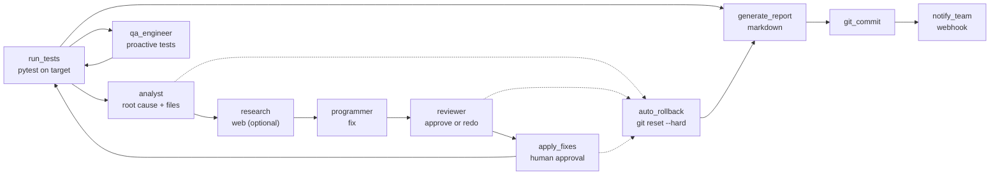

# DevOps Self-Healer (Agentic AI)

[](https://github.com/brenol404/DevOps-Self-Healer/actions/workflows/ci.yml)
[](https://www.python.org/)
[](LICENSE)

> Autonomous state-graph agent that runs tests, diagnoses failures, proposes fixes and commits — with human approval, automatic rollback and a final report.

**Leia em [português](README.pt-BR.md).**

> **Evidence:** 11-node LangGraph · **18 tests** · green CI · rollback tested with real git.

## Contents

- [Highlights](#highlights)
- [Architecture](#architecture)
- [Running](#running)
- [Semantic context via RAG](#semantic-context-via-rag)
- [Roadmap](#roadmap)
- [Structure](#structure)
- [Quality](#quality)

## Highlights

- **State-graph loop**: tests → analyst → programmer → reviewer → apply → QA, with conditional routing and bounded retries.
- **Selective context (Traceback-RAG)**: instead of dumping the whole repo, the parser extracts only the files in the traceback (±25 lines around each hit) — token-cheap by design.
- **Multi-model**: `LLM_PROVIDER` picks google / openai / ollama (100% local) via `.env`, no code changes.
- **Human-in-the-loop**: nothing hits the disk without your `Y` (skipped with `--ci`, no safety net).
- **Write containment**: LLM-chosen filenames are confined to the repo (`../evil.py` rejected, fail-closed) — validated by tests.
- **Panic button**: exhausted attempts → `git reset --hard` + `clean -fd`, then a final report.
- **Proactive QA**: after a green fix, the agent writes regression tests so the bug never returns.
- **Team notify**: Slack/Discord webhook at the end of each cycle.
- **Structured output**: Pydantic forces clean production-ready code, no chatter.
- **Rate-limit aware**: 429 backoff with retries instead of crashing.

## Architecture



## Running

1. Clone the repository.
2. Install dependencies:
   ```bash
   pip install -r requirements.txt
   ```
3. Create a `.env` file at the root with your key (`GEMINI_API_KEY`, `OPENAI_API_KEY`, or Ollama — see `.env.example`).
4. (Optional) Scaffold a test project with an intentional bug:
   ```bash
   python setup_cobaia.py
   ```
5. Start the agent (any repo; `--ci` skips human approval):
   ```bash
   python main.py --repo ./meu-projeto --max-attempts 5
   python main.py --repo ./meu-projeto --ci
   ```

## Semantic context via RAG

By default the analyst only sees traceback files. Pointing at a
[hybrid-rag-mcp](https://github.com/brenol404/hybrid-rag-mcp) with the target
repo indexed, it also receives *similar* snippets beyond the traceback:

```bash
# terminal 1: RAG server with the target repo indexed
python -m hybrid_rag_mcp --transport http --port 8000
# (via the `ingest` tool, index the target repo directory)

# terminal 2: healer with RAG on
export RAG_URL=http://127.0.0.1:8000  # + RAG_TOP_K / RAG_TIMEOUT_SEC / RAG_AUTH_TOKEN optional
python main.py
```

Without `RAG_URL` (or with the server down), diagnosis proceeds identically —
graceful degradation, never breaks the flow.

## Roadmap

Initial roadmap complete. V2 focused on safety, large-repo scale and enterprise use:

### Phase 1: Code safety and quality
- [x] **Auto-Rollback (panic button):** `git reset --hard` to restore the project when attempts run out.
- [x] **Reviewer node:** a reviewer agent checks Clean Code/SOLID before anything hits disk.

### Phase 2: Scaling and performance
- [x] **Selective context retrieval (Traceback-RAG):** regex on the traceback scopes reading to affected files only. Semantic/AST search remains future work.
- [x] **Agnostic multi-model support:** `.env` picks any LLM (OpenAI, Gemini) or fully local models (Ollama).

### Phase 3: Proactivity and team integration
- [x] **Proactive test generation:** the agent writes new `test_*.py` cases so the failure never repeats.
- [x] **Webhook notifications (Slack/Discord):** ping the dev chat after each cycle.

## Structure

```
.
├── main.py                 # CLI (--repo, --max-attempts, --ci)
├── setup_cobaia.py         # scaffolds a buggy demo project
├── agent/
│   ├── graph.py            # 11 nodes + conditional routing + guards
│   ├── rag_client.py       # optional hybrid-rag-mcp client (graceful)
│   └── state.py            # typed LangGraph state
└── tests/                  # routing, rollback (real git), write containment, RAG
```

## Quality

- **18 unit tests** (`pytest`), no LLM/network — routing, rollback with real git, path containment, RAG degradation.
- CI on every push/PR. Live runs need an LLM key (Gemini free tier works).
- Decisions that looked good but were cut or corrected are documented in commit history, not hidden.

## License

MIT licensed.
