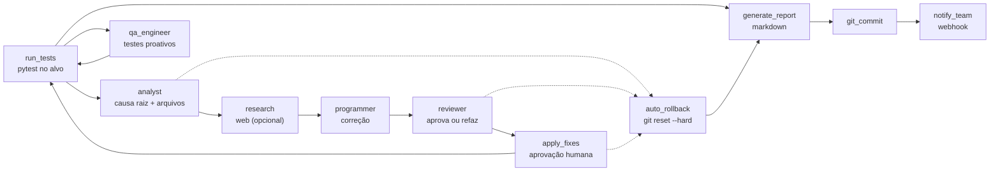

# DevOps Self-Healer (Agentic AI)

[](https://github.com/brenol404/DevOps-Self-Healer/actions/workflows/ci.yml)
[](https://www.python.org/)
[](LICENSE)

> Agente autônomo em grafos de estado que roda testes, diagnostica falhas, propõe correções e commita — com aprovação humana, rollback automático e relatório final.

**Read in [English](README.md).**

> **Prova:** 11 nós LangGraph · **18 testes** · CI verde · rollback testado com git real.

## Índice

- [Destaques](#destaques)
- [Arquitetura](#arquitetura)
- [Como executar](#como-executar)
- [Contexto semântico via RAG](#contexto-semântico-via-rag)
- [Roadmap](#roadmap)
- [Estrutura](#estrutura)
- [Qualidade](#qualidade)

## Destaques

- **Loop em grafo de estados**: testes → analyst → programmer → reviewer → apply → QA, com roteamento condicional e tentativas limitadas.
- **Contexto seletivo (Traceback-RAG)**: em vez de despejar o repo inteiro, o parser extrai do traceback só os arquivos afetados (±25 linhas por ocorrência) — econômico por desenho.
- **Multi-modelo**: `LLM_PROVIDER` escolhe google / openai / ollama (100% local) via `.env`, sem trocar código.
- **Aprovação humana**: nada vai pro disco sem o seu `Y` (pulado com `--ci`, sem rede de segurança).
- **Contenção de escrita**: nomes vindos do LLM ficam confinados ao repo (`../evil.py` rejeitado, fail-closed) — coberto por testes.
- **Botão de pânico**: tentativas esgotadas → `git reset --hard` + `clean -fd`, depois relatório final.
- **QA proativo**: após correção verde, o agente escreve testes de regressão pra falha nunca voltar.
- **Aviso ao time**: webhook Slack/Discord ao fim de cada ciclo.
- **Output estruturado**: Pydantic força código limpo e pronto, sem conversação.
- **Respeita rate-limit**: backoff com retries em 429 em vez de crashar.

## Arquitetura



## Como Executar

1. Clone o repositório.
2. Instale as dependências:
   ```bash
   pip install -r requirements.txt
   ```
3. Crie um `.env` na raiz com sua chave (`GEMINI_API_KEY`, `OPENAI_API_KEY`, ou Ollama — ver `.env.example`).
4. (Opcional) Crie um projeto de teste com bug intencional:
   ```bash
   python setup_cobaia.py
   ```
5. Inicie o agente (qualquer repo; `--ci` pula a aprovação humana):
   ```bash
   python main.py --repo ./meu-projeto --max-attempts 5
   python main.py --repo ./meu-projeto --ci
   ```

## Contexto semântico via RAG

Por padrão o analyst usa só os arquivos do traceback. Apontando para um
[hybrid-rag-mcp](https://github.com/brenol404/hybrid-rag-mcp) com o repo-alvo
indexado, ele recebe também trechos *similares* além do traceback:

```bash
# terminal 1: servidor RAG com o repo-alvo indexado
python -m hybrid_rag_mcp --transport http --port 8000
# (via tool `ingest`, indexe o diretório do repo-alvo)

# terminal 2: healer com RAG ligado
export RAG_URL=http://127.0.0.1:8000  # + RAG_TOP_K / RAG_TIMEOUT_SEC / RAG_AUTH_TOKEN opcionais
python main.py
```

Sem `RAG_URL` (ou com servidor fora do ar), o diagnóstico segue idêntico —
degradação graciosa, nunca quebra o fluxo.

## Roadmap

Roadmap inicial concluído. A V2 focou segurança, escala em repos grandes e uso enterprise:

### Fase 1: Segurança e qualidade do código
- [x] **Auto-Rollback (botão de pânico):** `git reset --hard` para restaurar o projeto ao esgotar tentativas.
- [x] **Nó de Code Reviewer:** revisor avalia Clean Code/SOLID antes de qualquer escrita em disco.

### Fase 2: Escalonamento e performance
- [x] **Recuperação seletiva de contexto (Traceback-RAG):** regex no traceback limita a leitura aos arquivos afetados. Busca semântica/AST segue como evolução futura.
- [x] **Suporte multi-modelo agnóstico:** `.env` escolhe qualquer LLM (OpenAI, Gemini) ou modelos 100% locais (Ollama).

### Fase 3: Proatividade e integração de equipe
- [x] **Geração proativa de testes:** o agente escreve novos `test_*.py` para a falha nunca se repetir.
- [x] **Notificações webhook (Slack/Discord):** avisa o chat do time após cada ciclo.

## Estrutura

```
.
├── main.py                 # CLI (--repo, --max-attempts, --ci)
├── setup_cobaia.py         # cria projeto demo com bug
├── agent/
│   ├── graph.py            # 11 nós + roteamento condicional + guardas
│   ├── rag_client.py       # cliente opcional do hybrid-rag-mcp (gracioso)
│   └── state.py            # estado tipado do LangGraph
└── tests/                  # roteamento, rollback (git real), contenção, RAG
```

## Qualidade

- **18 testes unitários** (`pytest`), sem LLM/rede — roteamento, rollback com git real, contenção de paths, degradação do RAG.
- CI a cada push/PR. Runs reais precisam de chave de LLM (tier grátis do Gemini funciona).
- Decisões que pareciam boas mas foram cortadas ou corrigidas ficam no histórico de commits, não escondidas.

## Licença

MIT.
